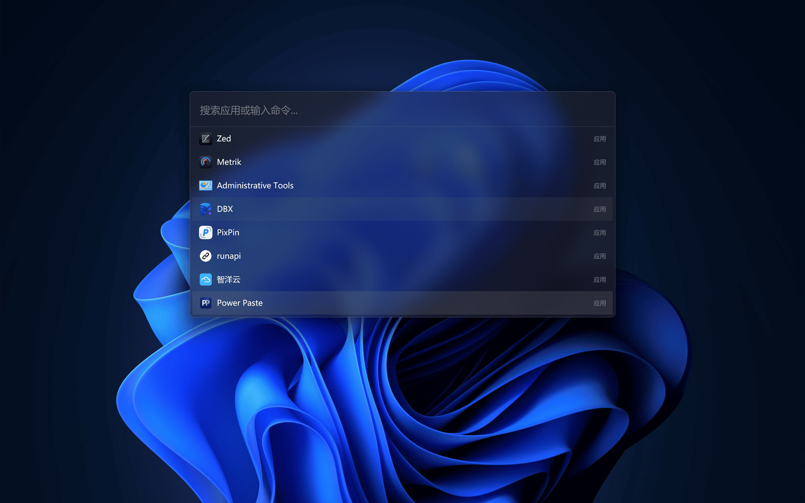

# Steward

<p align="center">
  
</p>

<p align="center">
  <a href="LICENSE"></a>
  
  
  <a href="https://github.com/iFence/steward"></a>
</p>

<p align="center">
  <a href="README.md">English</a>
</p>

Steward 是一个面向 Windows 的小而美的启动器和插件平台：基于 Rust、GPUI 与 `gpui-component` 构建。

产品目标是成为一个呼出即应、内存占用低、长期稳定的启动器，既满足日常快速启动应用的场景，也为开发者和高级用户留出可扩展的插件空间。核心应用拥有桌面壳、启动栏状态、快速导航与插件宿主；更重的能力通过独立进程插件隔离，既能持续演进，也不会拖慢或动摇核心的响应速度。

<p align="center">
  
</p>


## 仓库结构

```
steward/
├── Cargo.toml                 # Rust workspace 根
├── crates/
│   ├── app/                   # 二进制入口：GPUI 窗口/热键/生命周期
│   ├── core-engine/           # 搜索、索引、模糊匹配、排序（无 UI 依赖）
│   ├── plugin-host/           # 插件生命周期管理、路由、权限、IPC 网关
│   ├── plugin-registry/       # 插件元数据缓存（SQLite）
│   ├── storage/               # SQLite 封装、配置文件读写
│   ├── ui-components/         # 基于 gpui-component 的业务级 UI 组件
│   └── ipc-protocol/          # 主进程 <-> 插件运行时共享的消息协议定义
├── plugin-runtime/            # 独立插件宿主进程（内嵌 QuickJS）
├── packages/                  # TS 侧（pnpm workspace）
│   ├── extension-api/         # 面向插件开发者的 TS 类型声明 + 运行时 polyfill
│   └── plugins/               # 官方示例插件
├── docs/                      # 架构/API/manifest/基准文档
├── scripts/                   # 构建/打包/基准测试脚本
└── .github/workflows/         # CI / release
```

## 快速开始

前置要求：Rust stable、Node.js ≥ 20、pnpm。

```bash
# 原生应用（M0/M1）
cargo run -p steward-app

# TS 侧
pnpm install
pnpm build
```

启动后不会弹出窗口，应用驻留系统托盘；退出请用托盘菜单「退出 Steward」。

快捷键/交互：

- `Ctrl+Alt+Space`：呼出/隐藏快速启动栏
- `Esc`：隐藏快速启动栏
- 托盘左键：呼出/隐藏快速启动栏
- 托盘右键菜单：显示/隐藏、退出
- 鼠标按住快速启动栏任意位置：拖动窗口（输入区域同时可拖动）

## 文档

- [架构说明](docs/architecture.md)
- [插件 API 草案](docs/extension-api.md)
- [插件 manifest 规范草案](docs/plugin-manifest-spec.md)
- [性能基准](docs/benchmarks.md)

## 里程碑

- [x] M0：骨架能跑起来（GPUI 快速启动栏 + 全局热键 + 系统托盘）
- [x] M1：应用启动器 MVP（应用扫描 + nucleo 模糊匹配 + SQLite 索引）
- [ ] M2：插件系统 v1（JSON-RPC IPC + QuickJS 运行时 + 规模化对策）
- [ ] M3：插件 API 覆盖面 + Node polyfill + UI 打磨
- [ ] M4：Windows 支持完善
- [ ] M5：插件生态基础设施（脚手架、签名校验、插件市场）

## 许可证

[MIT](LICENSE)
